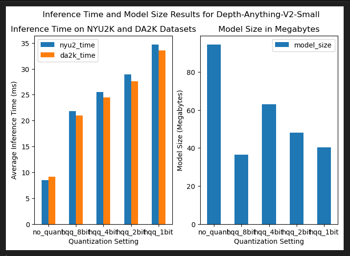

# CS 497/597 AI Hardware Final Project: Depth Estimation

## Team 2: The Convoluted
### Team Members:
- Adam Torek: adamtorek@u.boisestate.edu
- Niko Pedraza: nikopedraza@u.boisestate.edu
- Carson Keller: carsonkeller@u.boisestate.edu

## Project Purpose:

This project explores using the Depth-Anything-V2 monocular depth estimation model on
specialized hardware and studies the effect quantization plays on the model's performance. 
We used the Duckietown Robot as our hardware testing platform and Half-Quadratic Quantization
as our quantization scheme. For benchmarking Depth-Anything-V2 on our quantization settings, 
we used the DA-2K benchmark and the NYUV2 Depth Estimation Test datasets. We tested both 
the model's performance on these benchmarks as well as the average inference time and model
size to see the effect quantization has on both inference time and memory consumption. 

## Project Subsections:

This project contains two subsections: Our experimental evaluations and the 
duckiebot module. The experimental evaluations module can be found in the DepthAnythng_Evaluation
folder and the Duckiebot module that runs Depth Anything V2 can be found in the packages 
folder of this repository. Note: For our experimental evaluation, you will have to download
the NYUV2 and DA-2K datasets yourself from their respective websites. 

### DepthAnything V2 Evaluation 

This subsection of the project can be found in the DepthAnything_Evaluation subfolder of
this project. To run the quantization experiments, run the `quantization_runner.py` file
and provide it with the following command line arguments:

- `NYUV2 Dataset`: The directory where the NYU-2K dataset was stored

- `DA-2K Dataset`: The directory you stored the DA-2K benchmark

- `Output Directory`: The directory to write the experimental results to

Note: You will need to download both the NYUV2 and 
DA-2K datasets yourself. You can find them here:

- [NYUV2 Depth Dataset](https://www.kaggle.com/datasets/soumikrakshit/nyu-depth-v2)

- [DA-2K Dataset](https://huggingface.co/datasets/depth-anything/DA-2K)

This experimental evaluation will run different quantization settings on the Depth Anything V2
Small, Medium, and Large models using the NYU-V2 and DA-2K datasets. Our evaluations are currently
set up to run 8-bit, 4-bit, 2-bit, and 1-bit quantization using the half-quadratic quantization
(HQQ) technique (More information can be found here: [Link](https://mobiusml.github.io/hqq_blog/)) as well as the unquantized version of each model as a baseline. Our experiments
save the results into both a JSON and CSV file for analysis. We use
the following metrics to evaluate our Depth-Anything-V2 model and all of the quantization
trials:

- Absolute Relative \(Abs-Rel\) Difference: The mean of the absolute difference between a depth
estimation image and a ground truth depth image per pixel. This is used to benchmark model
performance on the NYU-V2 dataset to measure both how well the Depth-Anything-V2 model performs
as well as if quantization has any effect on the model's performance. 

- Delta-1 (D1) Ratio: This is the ratio of how many pixels in a depth estimation deviate from
a given depth ground truth image by more than 25% relative to all of the pixels in the image.
Used to measure how much the Depth-Anything-V2 model's estimations differ from the ground truth
in the NYU-V2 test benchmark, as well as the effect quantization has on that difference.

- Point Classification Accuracy: Given a set of images with two human-annotated points where one
is closer than the other, how many did the model guess was closer given the depth estimation image?
This was used to evaluate how well the Depth-Anything-V2 model did on the DA-2K benchmark. This
benchmark includes images in a variety of scenes with points chosen by the human annotators that
require fine-grained depth estimations to guess correctly. This metric was used to test if
quantization of the Depth-Anything-V2 model had any effect on its fine-grained estimation performance.

- Inference Time in milliseconds: This is the total time it took the Depth-Anything-V2 model to 
create a depth estimation given an input image of a scene. We measured this metric to see if 
quantization had any effect on the time it took for the Depth-Anything-V2 model to
create its estimations. This is important for real-time applications that are time-sensitive.

- Model Size in Megabytes: This measures the total memory footprint of the Depth-Anything-V2
model. We recorded this metric to see how much we could compress our Depth-Anything-V2 model
using the 8-bit, 4-bit, 2-bit, and 1-bit quantization sizes we tested.

You can find both the results and our interpretation of those results in either the 
analysis section of the README or the `results_visualization.ipynb` notebook. We ran our model
on a desktop computer with a NVIDIA RTX 3090 GPU with 24GB of VRAM, a 32 core AMD processor, 
and 64 GB of RAM. We used an Anaconda environment with Python version 3.11, PyTorch version 2.5,
CUDA version 11.8, and the Transformers library of version 

### DuckieBot Package

The purpose of this subsection of our project was to evaluate a possible deployment platform
for the Depth-Estimation-V2 model. We chose the DuckieTown Robot (DuckieBot) as our deployment
platform for this purpose. The DuckieBot is both a robotic platform and ecosystem that gives
researchers a standardized platform to conduct robotics research and a convenient set of
tools for higher education to teach robotics and autonomous systems to students online and
in person. We used the DuckieBot because of its ease of use, low cost, and community support 
options in case something went wrong. 

For our hardware, we used the DuckieBot DB21M platform, which is a ground-based robot with a 
single camera and powered by an NVIDIA Jetson Nano 2GB development board. We used the Daffy 
version of the DuckieBot software platform and created our package on top of the DuckieBot's 
prebuilt Robot Operating System (ROS) toolset. We used the unquantized Depth-Anything-V2 
base model as our monocular depth estimation model in a Python ROS package and deployed our model
to the robot using a Docker container. 

To run our model, connect a DuckieBot DB21M to a host computer with Docker, Python, and Pip 
installed. You will need the DuckieTown shell to build and deploy our package to the robot.
Follow [these instructions](https://docs.duckietown.com/daffy/opmanual-duckiebot/setup/setup_laptop/index.html) 
to set up your DuckieBot and deployment environment.

Once your DuckieBot and development platform are set up,
you can run the following command to build your docker
container once you are in the project directory:

`$ dts devel build -f`

And then run the following command to run our package
on your DuckieBot:

`$ dts devel run -R <robot name> -L depth-estimation -X`

Once it is running, you should see two windows with 
a live camera feed on one and a real-time depth estimation
from the Depth-Anything-V2 base model on the other. 

## Results

TODO: Put your results analysis and tables here

### Quantization Results

Overall, the half quadratic quantization (HQQ) method we used performed very well. The tables for all sizes of 
Depth-Anything-V2 show no decrease in accuracy, delta, and abs-rel metrics on
 the 8-bit, 4-bit, 2-bit, and 1-bit quantization sizes we tested. In fact, some quantization
 settings performed better than their unquantized version. In particular, the abs-rel score of 
 Depth-Anything-V2 increased on the NYUV2 Depth Anything dataset increased as quantization
 size decreased. There were also some decreases in model performance depending on quantization as well.
 For example, the accuracy of Depth-Anything-V2 small on the DA-2K dataset decreased from 49.8% unquantized to
  47.1% on HQQ's 2 bit quantization setting. However, this performance decrease is not
  reflected for the base or large model sizes. Overall, HQQ quantization is good at preserving
  model performance. We think that HQQ preserves model performance because it accounts for outliers
  and important weights in the weight distribution of the model being quantized through its 
  half-quadratic optimization method. 

  

  HQQ's biggest impact during our evaluation was on the average inference time for model sizes.
  The graphs above clearly show a linear increase in average inference time on both the NYUV2 Depth
  and DA-2K datasets as the quantization size decreases for all Depth-Anything-V2 sizes. We believe
  this result is likely due to This shows
  that lower HQQ quantization sizes will hurt real-time performance on depth estimation models 
  like Depth-Anything-V2. We believe that this is due to weight dequantization and re-quantization
  that occurs during inference. The tighter the quantization bound is, the more processing power
  needs to be spend de-compressing and re-compressing model weights, and thus overall inference time
  increases. 

HQQ quantization also decreased the memory size of all Depth-Anything-V2 models, but 
there is no linear decrease in model size as quantization decreases. Instead, 8-bit
quantization seems to have the biggest decrease in model size relative to the unquantized
version, with 1-bit quantization following closely behind for the biggest model size decrease. Interestingly, 2-bit and especially 4-bit quantization had the smallest decreases on model sizes of all quantization settings. We expected that model size in memory would
decrease linearly as the quantization size decreased, but that did not happen. We do not have a good explanation for why this is the case. Our best guess is that is has something to do with the hardware and firmware of the NVIDIA RTX 3090 GPU we evaluated on. There was likely some 
optimization in the hardware and firmware of the 3090 that made 8-bit quantization more efficient than other forms of quantization.

## Citations

- Badri, H., & Shaji, A. (2023). Half-Quadratic Quantization. Github.io. https://mobiusml.github.io/hqq_blog/

- Paull, L., Tani, J., Ahn, H., Alonso-Mora, J., Carlone, L., Cap, M., Chen, Y. F., Choi, C., Dusek, J., Fang, Y., Hoehener, D., Liu, S.-Y., Novitzky, M., Okuyama, I. F., Pazis, J., Rosman, G., Varricchio, V., Wang, H.-C., Yershov, D., & Zhao, H. (2017, May 1). Duckietown: An open, inexpensive and flexible platform for autonomy education and research. IEEE Xplore; IEEE. https://doi.org/10.1109/ICRA.2017.7989179

- Silberman, N., Kholi, P., Hoiem, D., & Fergus, R. (2012). NYU Depth V2 «Nathan Silberman. Cs.nyu.edu; NYU. https://cs.nyu.edu/~fergus/datasets/nyu_depth_v2.html

- Wolf, T., Debut, L., Sanh, V., Chaumond, J., Delangue, C., Moi, A., Cistac, P., Rault, T., Louf, R., Funtowicz, M., & Brew, J. (2020). HuggingFace’s Transformers: State-of-the-art Natural Language Processing. ArXiv:1910.03771 [Cs]. https://arxiv.org/abs/1910.03771

- Yang, L., Kang, B., Huang, Z., Zhao, Z., Xu, X., Feng, J., & Zhao, H. (2024). Depth Anything V2. ArXiv.org. https://arxiv.org/abs/2406.09414